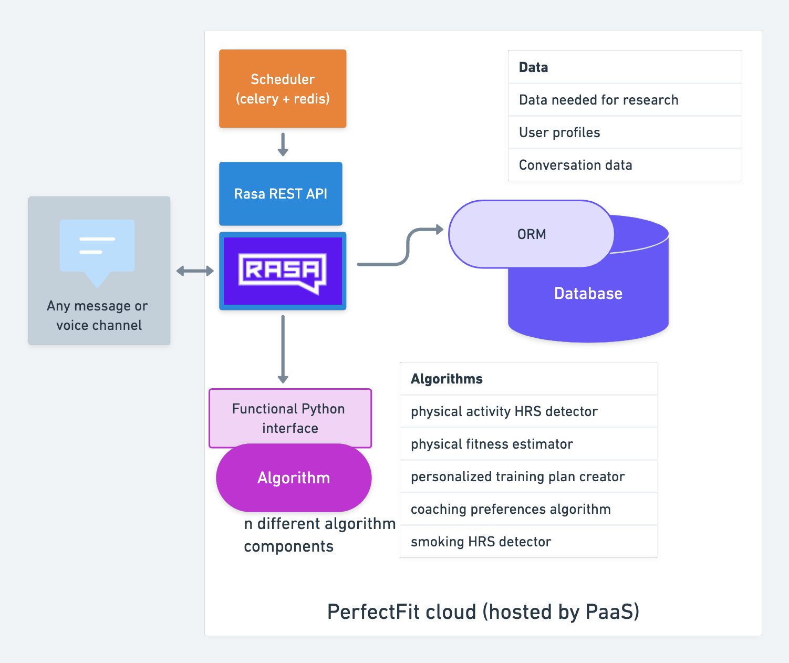

# Design (v0.1) generic version of the Perfect Fit virtual coach system

## Why do we need a separate generic version?
Because of the Niceday and Sensor Data Collector dependencies 
and their entangledness with the conversations and rasa actions 
there is no simple clear boundary between those dependencies and the VC.
This is inherent to the requirements for the app and not something that is easily made modular.
To reuse the software beyond the Perfect Fit project a generic version is envisioned.

## The 'generic version'
The generic version is a trimmed down version of the 'original' virtual coach system.
All proprietary dependency specific parts will be removed. 
(Part of) dialogs that are dependency-specific will be removed or adapted. 
For example, we will take out (part of) dialogs that are about the number of cigarettes smoked in a day as tracked by the Niceday app, 
instead we might ask the user how many cigarettes they smoked. 
There will thus be a separate end-product: 
A trimmed-down version of the PerfectFit chatbot 
that is available to be used with any of the supported [Rasa Messaging Channels](https://rasa.com/docs/rasa/messaging-and-voice-channels/). 
Reusing the product would mean cloning the repo and configuring your own messaging channel, 
possibly adapting the dialogs.

## Diagram

See it also on [whimsical](https://whimsical.com/perfectfit-UtvRnxdP8P79humXTnjb9J)

## Timeline
The main priority in Perfect Fit is to get a working virtual coach **that depends on niceday and Sensor Data Collector**.
This design document will be further refined when the 'original' virtual coach is in a more final state (probably spring 2023).
Nevertheless it will help us to keep this in the back of our head when developing the 'original' virtual coach.
